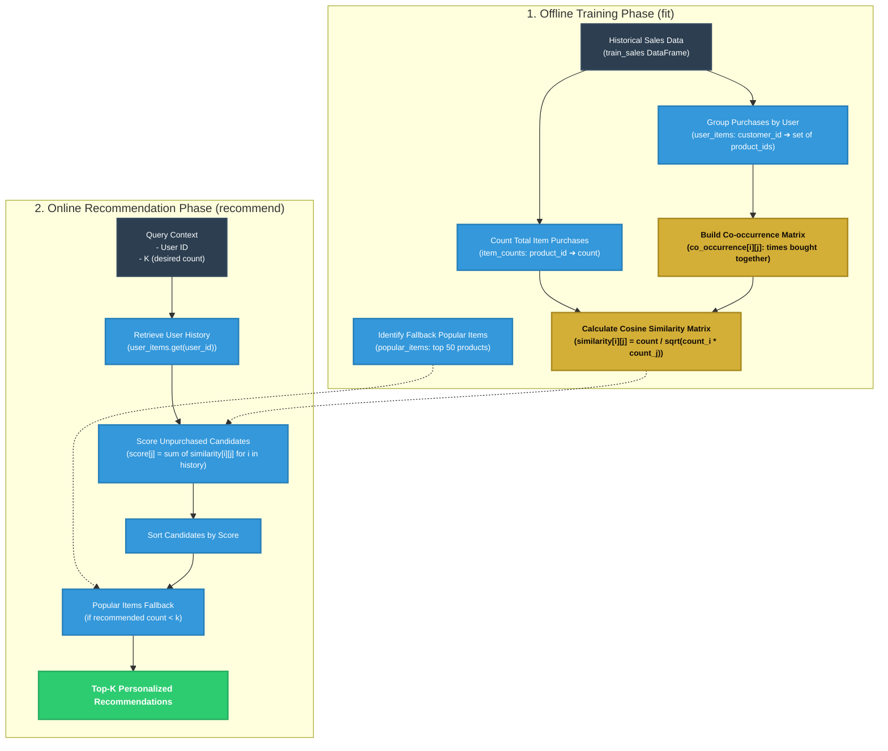
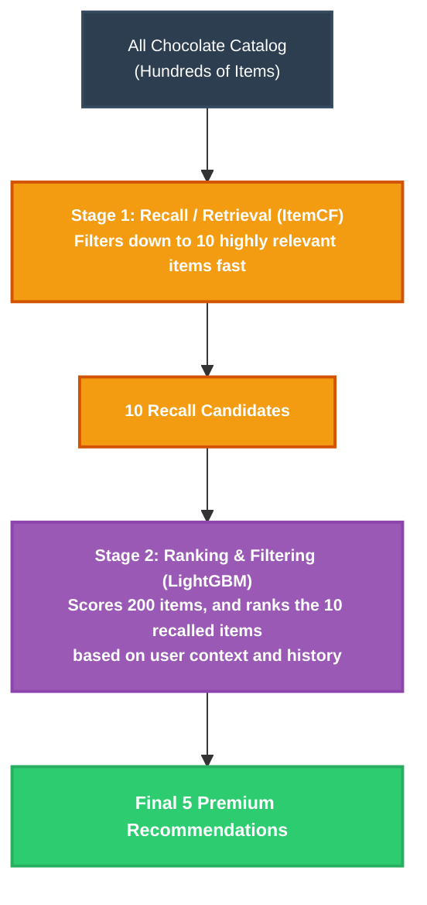

# 🍫 Item-Based Collaborative Filtering (ItemCF) & Hybrid Recommender

This directory contains the **Item-Based Collaborative Filtering (ItemCF)** recommendation engine, an elegant and widely-used classical algorithm for recommendation systems. Additionally, this guide explains how the system implements a modern, industrial **Two-Stage Hybrid Recommendation Pipeline** by combining ItemCF with LightGBM.

---

## 📐 ItemCF Architecture Diagram

The ItemCF algorithm is split into two primary operational phases: **Offline Training (`fit`)** and **Online Serving (`recommend`)**.



---

## 📖 The Shopper's Journey: ItemCF Storyline Explanation

Let’s follow the journey of **Bob**, a chocolate lover who has previously purchased two specific items: **Lindt Excellence Sea Salt** and **Toblerone Milk Chocolate**.

### 🚉 Step 1: Training the Model (Offline)
Before Bob even loads the app, the system runs `fit()` to build its understanding of how products relate to each other:
1. **Grouping User Purchases**: The engine groups all transaction records. It records that Bob bought `{Lindt_Sea_Salt, Toblerone_Milk}`.
2. **Item Count & Co-occurrence**: The engine counts how many times each chocolate is bought across all users. For every user transaction containing multiple products, it increments a co-occurrence counter. For example, if 100 users bought **Lindt Excellence Sea Salt** and **Godiva Dark 70%** together, `co_occurrence[Lindt_Sea_Salt][Godiva_Dark]` will equal `100`.
3. **Similarity Calculation**: Using the cosine similarity formula, the engine normalizes the co-occurrences:
   $$\text{Similarity}(i, j) = \frac{|N(i) \cap N(j)|}{\sqrt{|N(i)| \times |N(j)|}}$$
   This prevents highly popular items from dominating the similarity scores. The result is stored in `self.similarity`.

### 🛂 Step 2: Querying the Online Recommender
When Bob logs in, `recommend(user_id='Bob', k=5)` is executed:
1. **Retrieve History**: The recommender fetches Bob's history: `{Lindt_Sea_Salt, Toblerone_Milk}`.
2. **Candidate Scoring**: The recommender iterates over each item in Bob's history. For **Lindt Excellence Sea Salt**, it looks up its similar items (e.g., **Lindt Dark Chilli** with similarity `0.45`, **Godiva Dark** with similarity `0.30`). It accumulates these scores for items Bob **has not yet purchased**:
   * **Lindt Dark Chilli**: Score = `0.45`
   * **Godiva Dark**: Score = `0.30`
3. **Sorting & Selection**: The candidate items are sorted in descending order of their accumulated scores. The top-ranked items are returned.
4. **Cold Start Fallback**: If Bob has no purchase history or has bought very few items (resulting in less than `k` recommendations), the algorithm fills the remaining slots using the precalculated `self.popular_items` list.

---

## ⚡ The Modern Two-Stage Hybrid Recommender

In a real-world enterprise environment, scoring thousands of candidates with complex models (like Deep Learning or Gradient Boosted Decision Trees) for every single request is too slow.

To solve this, `simulation/server.py` implements an industry-standard **Two-Stage Hybrid Recommendation Pipeline** when the user selects the `hybrid` model:



### 🛠️ Code Implementation Detail

The hybrid recommender logic is elegantly orchestrated inside `simulation/server.py` (lines 190–198):

```python
if model_name == 'hybrid':
    # 🔥 INDUSTRIAL TWO-STAGE PIPELINE 🔥
    # Stage 1: Recall 10 items using ItemCF (High-Recall, Low-Latency)
    cf_recall_ids = recommenders['itemcf'].recommend(user_id, k=10, store_id=store_id)
    
    # Stage 2: Rank candidates using LightGBM (High-Precision, Feature-Rich)
    # Score all products via LightGBM and filter down to the 10 recalled candidates
    lgb_ranked_ids = recommenders['lightgbm'].recommend(user_id, k=200, store_id=store_id)
    rec_product_ids = [pid for pid in lgb_ranked_ids if pid in cf_recall_ids][:5]
```

### 💡 Why This Hybrid Architecture Wins
1. **Low Latency & Scalability**: ItemCF is extremely fast because it uses in-memory dictionary lookups based on precalculated item similarities. By generating a small candidate pool of 10 items first, we avoid running expensive feature extraction and inference operations for the whole product catalog.
2. **Context-Aware Precision**: While ItemCF is blind to current context (like store location, user demographics, or time of day), the **LightGBM** ranking stage incorporates real-time features (such as user age, gender, loyalty membership, store type, and transaction averages) to fine-tune the final recommendation scores.
3. **Best of Both Worlds**: The resulting recommendations are highly personalized based on historical co-occurrences (thanks to ItemCF recall) and optimized for high conversion probability under active contextual conditions (thanks to LightGBM ranking).
