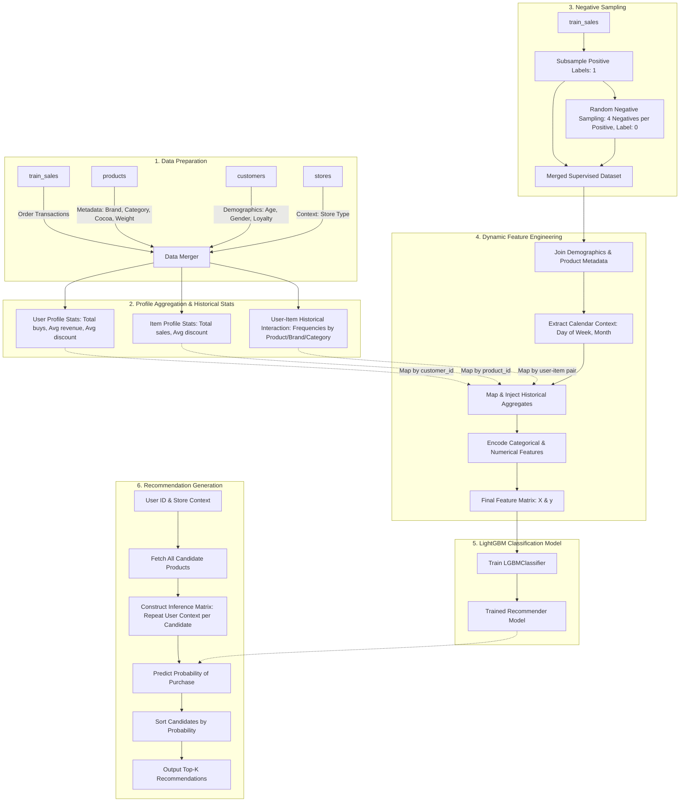

# LightGBM Recommender System

This directory houses the **LightGBM Recommender**, a supervised machine learning-based recommendation engine built on top of LightGBM. It formulates recommendation as a binary classification problem: predicting the probability of a user purchasing a specific item under given contexts (e.g., store type, date/time, and user-item interaction histories).

---

## 🏗️ Architecture Overview

The system transitions from transactional data to highly personalized recommendations using a multi-stage supervised learning pipeline. Below is the architecture flowchart mapping out the lifecycle of the model:



---

## 🛠️ Step-by-Step Implementation Flow

We built `LightGBMRecommender` systematically through the following stages:

### Step 1: Base Recommender Alignment & Initialization
We inherit from `BaseRecommender` to ensure compliance with the evaluation suite.
- **Categorical Mappings**: Defined rigid integer mappings for categorical properties (gender, brand, chocolate category, and store types) to avoid training leakage and ensure stable execution.
- **Aggregated Memory Structures**: Initialized lookup dictionaries (`self.user_stats`, `self.item_stats`, and interaction frequency tables) to cache pre-calculated histories.

### Step 2: Statistical Profiling (`fit` stage)
To provide the model with prior collaborative signals without training on dense user-item matrices, we compute granular, historical aggregates from `train_sales`:
1. **User Profile**: Tracks total purchases, average transaction revenue, and average discount applied.
2. **Item Profile**: Tracks total volume sold and average discount rate for each product.
3. **Interaction Profiling**: Stores historical user-product frequencies, user-brand frequencies, and user-category purchase frequencies to capture deep brand/category affinities.

### Step 3: Negative Sampling & Supervised Set Construction
Since standard click/sales logs only register positive interactions (purchases), we construct negative training labels:
- **Subsampling**: We sample up to $50,000$ active positive purchases to keep memory footprint and training speed optimal.
- **Negative Generation**: For each positive transaction, we randomly select **4 candidate products** that the customer did not purchase in that order, assigning them a label of `0` with matching order dates, stores, and quantities.
- **Data Assembly**: The positive and negative samples are stacked to form the target dataframe.

### Step 4: Contextual Joining & Feature Matrix Generation
We enrich the training dataset by merging the product metadata, customer demographics, and store attributes. Features are categorized as:
- **User Demographics**: `user_age`, `user_gender` (encoded), `user_loyalty` (categorical).
- **Item Metadata**: `item_cocoa` (percent), `item_weight`, `item_category` (encoded), `item_brand` (encoded).
- **Contextual Variables**: `store_type` (encoded), `day_of_week` (categorical), `month` (categorical).
- **Statistical Aggregates**: Average revenues, total sales, and user-item/brand/category historical counter values.

### Step 5: Supervised Model Training
We feed the clean feature matrix $X$ and label array $y$ into LightGBM:
```python
self.model = lgb.LGBMClassifier(
    n_estimators=120,
    max_depth=6,
    learning_rate=0.1,
    subsample=0.8,
    colsample_bytree=0.8,
    random_state=42,
    n_jobs=-1,
    verbosity=-1
)
```
Categorical features are specified explicitly using Pandas `Categorical` type to allow LightGBM's native categorical split optimization to run optimally.

### Step 6: Prediction & Multi-Candidate Inference (`recommend` stage)
During recommendation generation:
1. We retrieve the complete list of candidate items.
2. We replicate the target user's context (demographics, context parameters like `day_of_week`, `month`, and current `store_id`) across all product candidates.
3. We query the historical interaction maps for this specific `user_id` and the candidate product attributes.
4. The model computes $P(\text{Purchase} = 1)$ for each candidate.
5. The candidates are ranked, returning the Top-$K$ items.
