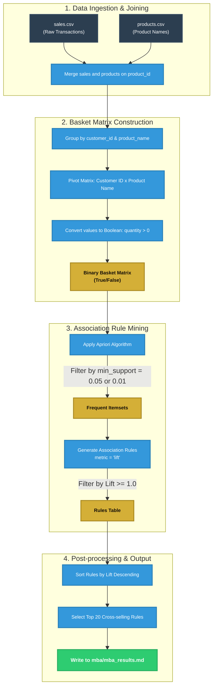

# 🛒 Market Basket Analysis (MBA)

This directory contains the **Market Basket Analysis (MBA)** recommender system, implemented using association rule mining. It extracts powerful cross-selling rules by analyzing transaction histories to identify products commonly purchased together by the same customers.

---

## 🏗️ Market Basket Analysis Pipeline

Unlike supervised classifiers (such as LightGBM or Neural NCF), **Market Basket Analysis is an unsupervised/heuristic statistical model**. It does **NOT** require negative sampling or deep learning embeddings. It operates strictly by counting co-occurrences of positive transactions.

Below is the data pipeline mapping out the process:



---

## 📐 Mathematical Metrics

Market Basket Analysis extracts rules of the form **Antecedent ($A$) $\rightarrow$ Consequent ($C$)** (e.g., *If a customer buys "Hershey Dark", they are also highly likely to buy "Lindt Milk"*). Three critical metrics measure the quality of these rules:

### 1. Support
Support measures how frequently a specific itemset appears in all baskets. It indicates the popularity of the item combination.
$$\text{Support}(A \rightarrow C) = P(A \cap C) = \frac{\text{Number of baskets containing both } A \text{ and } C}{\text{Total number of baskets}}$$

* *Usage*: Used to filter out extremely rare, random product combinations.

### 2. Confidence
Confidence measures how often the rule is true. It represents the conditional probability that a customer buys $C$ given that they have purchased $A$.
$$\text{Confidence}(A \rightarrow C) = P(C | A) = \frac{\text{Support}(A \rightarrow C)}{\text{Support}(A)}$$

* *Example*: A confidence of `0.70` means $70\%$ of customers who bought $A$ also bought $C$.

### 3. Lift
Lift evaluates the strength of a rule compared to random chance. It is the ratio of the observed support of $A$ and $C$ together to the expected support if they were completely independent.
$$\text{Lift}(A \rightarrow C) = \frac{\text{Confidence}(A \rightarrow C)}{\text{Support}(C)} = \frac{P(A \cap C)}{P(A) \cdot P(C)}$$

* **$\text{Lift} > 1$**: Highly positive correlation. Buying $A$ significantly increases the likelihood of buying $C$.
* **$\text{Lift} = 1$**: Complete independence. Buying $A$ has no influence over buying $C$.
* **$\text{Lift} < 1$**: Negative correlation. Buying $A$ decreases the likelihood of buying $C$ (substitute items).

---

## 🛠️ Step-by-Step Implementation Flow

We implemented `market_basket_analysis.py` through the following logical steps:

### Step 1: Customer-Level Basket Consolidation
In our database, each individual `order_id` contains only a single product transaction. To conduct a classic market basket analysis, we group all products purchased historically by the same **`customer_id`** into a single consolidated transaction basket (a customer-centric purchasing profile).

### Step 2: Pivoting to a Sparse Binary Matrix
The merged transaction DataFrame is grouped and pivoted:
```python
basket = (df.groupby(['customer_id', 'product_name'])['quantity']
          .sum().unstack().reset_index().fillna(0)
          .set_index('customer_id'))
```
This is mapped to True/False:
```python
basket_sets = basket.map(lambda x: x > 0)
```
This results in a clean boolean table where each row is a customer, each column is a product, and `True` signals that the customer has bought that product.

### Step 3: Mining Frequent Itemsets via Apriori
The boolean table is fed into the Apriori algorithm from the `mlxtend` package:
```python
frequent_itemsets = apriori(basket_sets, min_support=0.05, use_colnames=True)
```
If no itemsets meet the threshold (due to high SKU sparsity), the script gracefully falls back to `min_support=0.01` to ensure we capture valuable rules.

### Step 4: Extracting Association Rules
We extract rules from the frequent itemsets, filtering to keep only those with a positive relationship:
```python
rules = association_rules(frequent_itemsets, metric="lift", min_threshold=1)
```

### Step 5: Sorting & Exporting
The rules are sorted descending by `lift` to bring the strongest cross-selling pairings to the top. The Top 20 rules are formatted as a Markdown table and written to **`mba/mba_results.md`**.
