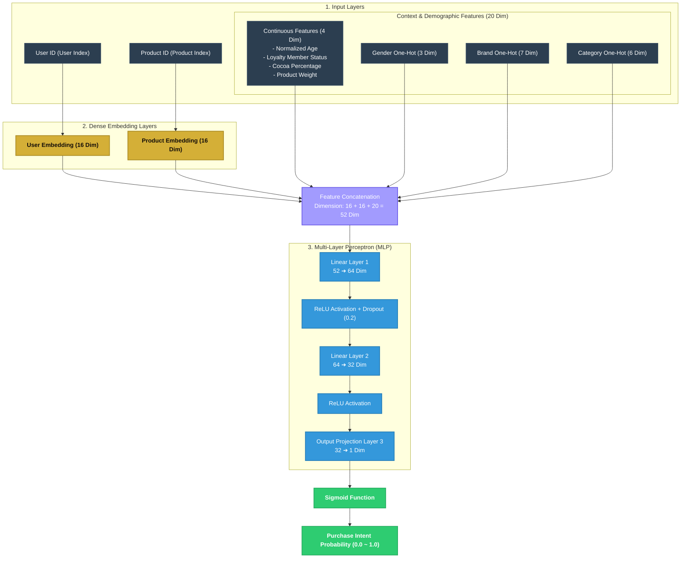

# 🍫 Neural Collaborative Filtering (NCF) Recommender

This directory houses the PyTorch implementation of the **Neural Collaborative Filtering (NCF)** recommendation pipeline combined with **Auxiliary Demographic and Contextual Features**.

---

## 📐 Neural Network Architecture Diagram

The model combines high-dimensional sparse representations (ID Embeddings) with context-aware features, routing them through a multi-layer perceptron (MLP) to output a purchase probability.



---

## 📖 The Shopper's Journey: A Storyline Explanation

To truly understand how this neural network thinks, let’s follow the story of **Alice**, a 28-year-old chocolate enthusiast shopping at the *Airport Premium Store*, as she encounters a candidate product: **Godiva Dark Chocolate 70% (100g)**.

### 🚉 Step 1: The Entry Tickets (Inputs)
When Alice walks into the store (or clicks the app), the system prepares the raw data variables which are processed and loaded into PyTorch `Tensor` inputs in **`NeuralRecommender.recommend()`**:
* **The User ID**: Alice's User ID (`C000004`), mapped to its numeric index `42` and loaded into **`u_tensor`** (a `torch.tensor` of type `torch.long`).
* **The Item ID**: The candidate Godiva chocolate ID (`P0008`), mapped to its numeric index `107` and loaded into **`i_tensor`** (`torch.long`).
* **The Context Tensors (20 Dimensions)**: Normalized and one-hot encoded variables concatenated into **`f_tensor`** (a `torch.tensor` of type `torch.float32` created from numpy variables):
  * **Continuous Normalization**: Her age is min-max scaled in numpy to `0.19` (`age_norm`), and Godiva's features are scaled to `0.70` (`cocoa_norm`) and `0.33` (`weight_norm`).
  * **One-Hot Encoding**: Categorical inputs mapped via **`np.eye()`**: her gender `Female` is one-hot mapped to `[0, 1, 0]` (`gender_onehot`), Godiva brand mapped to `[0, 0, 0, 0, 1, 0, 0]` (`brand_onehot`), and category `Dark` mapped to `[0, 0, 1, 0, 0, 0]` (`cat_onehot`).

---

### 🛂 Step 2: The Passport Office (Embedding Layers)
To transform raw indexes into dense continuous representations, the model routes **`user_indices`** and **`item_indices`** through the embedding layers defined in **`NCFModel`**:
* **User Embedding**:
  * *Code Definition*: **`self.user_embed = nn.Embedding(num_users, embed_dim)`** inside `NCFModel.__init__()` (where `embed_dim=16`).
  * *Forward Execution*: **`user_vec = self.user_embed(user_indices)`** inside `NCFModel.forward()`.
  * *Action*: Converts Alice's index `42` into a **16-dimensional vector** of continuous floats representing her latent taste preferences.
* **Item Embedding**:
  * *Code Definition*: **`self.item_embed = nn.Embedding(num_items, embed_dim)`** inside `NCFModel.__init__()`.
  * *Forward Execution*: **`item_vec = self.item_embed(item_indices)`** inside `NCFModel.forward()`.
  * *Action*: Converts Godiva chocolate index `107` into a **16-dimensional vector** representing its latent product characteristics.

---

### 🤝 Step 3: The Assembly Line (Concatenation)
The model must now merge all extracted representations side-by-side:
* *Code Line*: **`combined = torch.cat([user_vec, item_vec, aux_features], dim=1)`** inside `NCFModel.forward()`.
* *Action*: Concatenates the 16D User vector, the 16D Item vector, and the 20D auxiliary features tensor along `dim=1`. This compiles a single unified **52-dimensional vector** ($16 + 16 + 20 = 52$) representing the complete combined query context.

---

### 🧠 Step 4: The VIP Tasting Lounge (MLP Layers)
The 52-dimensional combined vector is passed through the deep neural network layers defined sequentially in **`self.mlp`** within **`NCFModel.__init__()`**:
1. **Layer 1 (`nn.Linear(52, 64)`)**: Takes the 52-dimensional input and projects it to a **64-dimensional hidden layer**, mathematically crossing user profile attributes with product categories (e.g. crossing her age with Godiva's premium category).
2. **Activation 1 (`nn.ReLU()`)**: Applies the Rectified Linear Unit activation, zeroing out negative features ($\max(0, x)$) to keep only strong positive activation signals.
3. **Dropout (`nn.Dropout(0.2)`)**: Randomly deactivates 20% of the active nodes during training, forcing the network to discover generalizable pathways instead of overfitting on Alice's specific ID.
4. **Layer 2 (`nn.Linear(64, 32)`)**: Projects the 64-dimensional activation space down to a compact **32-dimensional layer** representing high-level semantic behavior metrics.
5. **Activation 2 (`nn.ReLU()`)**: Applies the second non-linear filter to the compressed features.
6. **Layer 3 (`nn.Linear(32, 1)`)**: Projects the 32-dimensional features down to a **single raw linear log-odds score**.

---

### 🏁 Step 5: The Checkout Gate (Sigmoid Activation)
The final raw linear value is squashed into a clean probability:
* *Code Definition*: **`nn.Sigmoid()`** is the final layer of the `self.mlp` sequence.
* *Forward Execution*: **`return self.mlp(combined).view(-1)`** inside `NCFModel.forward()`.
* *Action*: The Sigmoid function maps the unbound linear output score to a probability scale between `(0, 1)`.
* *UI Outcome*: The serving API in `simulation/server.py` receives the score, and Alice see **Godiva Dark Chocolate 70%** recommended on her interface with **"Purchase Intent: 84.3%"**!


---


## 🧠 Deep-Dive: Training Workflow & Mechanics

Here is a detailed breakdown of the operations performed during the model's training execution cycle:

### 1. Map Vocabularies
* **The Mechanism**: Maps raw, sparse customer string IDs (e.g. `C000004`) and product string IDs (e.g. `P0008`) to contiguous integer values starting from `0` up to `N-1`.
* **Why it's necessary**: PyTorch `nn.Embedding` layers act as highly optimized continuous index lookups. Passing raw strings directly to GPU tensors is not supported; mapping them to contiguous integers allows rapid index slicing to extract embedding vectors. It also includes an `UNKNOWN` token mapping to safely handle cold-start entities at serving time.

### 2. Negative Sampling
* **The Mechanism**: Implicit feedback dataset contains only positive checkout events (labels of `1.0`). We randomly pair active customers with products they have *not* bought in the historical logs, assigning a label of `0.0`.
* **Why it's necessary**: If a binary classification neural network is trained exclusively on positive transactions, it will quickly converge on a trivial solution—always predicting a `1.0` probability for any user-item pair. Synthesizing negative interactions provides contrast, teaching the model the subtle mathematical boundaries between preferred chocolates and ignored chocolates.

### 3. Feature Engineering & Normalization
* **Continuous Features (Age, Cocoa%, Weight)**: Scaled to `[0.0, 1.0]` using Min-Max scaling.
  * *Why*: High-magnitude raw variables (e.g. a weight of `200g` vs an age of `18`) produce large gradients that dominate backpropagation, causing optimization instability. Scaling ensures all inputs contribute proportionally to weight updates.
* **Categorical Features (Gender, Brand, Category)**: Mapped to a binary 1/0 One-Hot matrix using `np.eye()`.
  * *Why*: Simply mapping Categories to integers (e.g., White=`1`, Dark=`2`, Truffle=`3`) introduces an artificial mathematical ordinal relationship (e.g., Truffle is "greater than" White), which confuses the linear weights. One-hot encoding creates orthogonal dimensions representing categorical choices independently.

### 4. Tensor Loading (ChocolateDataset & DataLoader)
* **The Mechanism**: Converts NumPy arrays into Torch long and float Tensors, organizing them in a shuffled `DataLoader` with a configured batch size.
* **Why it's necessary**: Tensors are essential to load data into memory formats optimized for GPU matrix multiplication. Shuffling prevents the neural network from memorizing sequence patterns in the input file (e.g. the model assuming consecutive rows are highly correlated). Batching manages memory limits, feeding manageable slices of data into the network at a time.

---

## 🔁 Detailed Backpropagation & Optimization Loop

The core learning occurs in **Step 6 (PyTorch Training Loop)**. Under the hood, for each epoch and batch of data, the model executes a series of mathematical steps to adjust its weights:

```
[Batch Inputs] ➔ 1. forward() ➔ [Predictions] ➔ 2. BCELoss() ➔ [Loss Value]
                                                                     │
[Updated Weights] ⬅ 4. optimizer.step() ⬅ 3. loss.backward() [Gradients] ⬅┘
```

#### A. Zeroing Out Gradients (`optimizer.zero_grad()`)
At the start of every mini-batch iteration, the gradients stored in PyTorch's parameter graph must be completely reset to zero.
* *Mechanics*: In PyTorch, gradients are accumulated (`add` operations) by default across multiple backpropagation runs (which is useful for architectures like Recurrent Neural Networks). If we do not explicitly call `zero_grad()`, the gradients from the previous batch will add to the current batch, resulting in bloated gradient updates that quickly explode the weights.

#### B. The Forward Pass (`self.model(...)`)
The batch of User Indices, Item Indices, and 20D Auxiliary Tensors are passed into `NCFModel.forward()`.
* *Mechanics*: 
  1. The User Index slices the user embedding tensor to retrieve a `16D vector`.
  2. The Item Index slices the item embedding tensor to retrieve another `16D vector`.
  3. These are concatenated with the `20D aux_features` to create a `52D dense vector`.
  4. The 52D vector passes through a linear layer (`Y = W_1 * X + B_1`), resulting in `64 values`.
  5. The `ReLU` activation function filters these values: $f(x) = \max(0, x)$.
  6. The `Dropout` layer randomly drops 20% of these values to prevent over-reliance on individual nodes.
  7. The vector passes through the final layers, ending in a `Sigmoid` function: $S(x) = \frac{1}{1 + e^{-x}}$, yielding a value in `(0, 1)`.

#### C. Calculating the Loss (`nn.BCELoss()`)
The predicted intent probability $\hat{y}$ is compared against the actual transactional truth $y$ ($1$ for buy, $0$ for no-buy) using Binary Cross-Entropy Loss:
$$\mathcal{L} = - [y \log(\hat{y}) + (1 - y) \log(1 - \hat{y})]$$
* *Mechanics*: This calculates the logarithmic "distance" between prediction and reality. If the model is confident in a wrong prediction (e.g., predicting 99% probability of purchase for a negative sample), the loss value spikes astronomically, signaling a major mistake.

#### D. The Backward Pass (`loss.backward()`)
Using PyTorch's Autograd engine, the model backpropagates the loss value through every connection in the network.
* *Mechanics*: Autograd applies the calculus **Chain Rule** starting from the final loss layer, working backward to calculate the partial derivatives (gradients) of the loss with respect to every single parameter (weight and bias) in the network. This represents *how much* a tiny change in a specific weight would increase or decrease the overall error.

#### E. Weight Update (`optimizer.step()`)
The Optimizer (Adam) updates all trainable parameters based on the calculated gradients:
$$W \leftarrow W - \eta \cdot \text{Update(Gradient)}$$
* *Mechanics*: Rather than using a simple learning rate $\eta$ (Stochastic Gradient Descent), **Adam (Adaptive Moment Estimation)** maintains running averages of both the first moment (the mean) and the second moment (the uncentered variance) of the gradients for each parameter. This allows it to dynamically scale the learning rate per weight—taking large, confident steps for flat features and small, cautious steps for volatile features, ensuring incredibly stable and fast convergence.

---

The NCF model processes recommendations through four precise operational stages, combining historical collaborative feedback with real-time customer demographics:

### 1. Dense Embedding Stage
* **User Embedding (`self.user_embed`)**: Maps sparse, high-dimensional customer IDs to a dense **16-dimensional** space. Similar customer taste profiles naturally cluster closer together in this latent mathematical space.
* **Item Embedding (`self.item_embed`)**: Maps chocolate product IDs to a dense **16-dimensional** vector space, projecting items with similar co-occurrence and category profiles into adjacent coordinates.

### 2. Demographic & Context Feature Engineering
Beyond sparse IDs, the network integrates **20 dimensions of auxiliary features** to solve cold start limitations and capture immediate context:
* **Continuous Feature Normalization**: Scales features like Age, Cocoa content, and Weight using min-max mapping to a standardized `[0, 1]` range, preventing high-variance attributes from dominating the gradients.
* **One-Hot Encoding**: Encodes categorical attributes (Gender, Brand, and Category) as binary vectors (e.g., Gender ➔ `[Male, Female, Unknown]`), enabling the feed-forward layers to calculate distinct weights per demographic category.

### 3. Feature Concatenation (Combine Stage)
* The model concatenates the `16D User Vector`, the `16D Item Vector`, and the `20D Auxiliary Feature Vector` along the first dimension to build a unified **52-dimensional super-vector**. This represents the complete combination of "shopper identity", "candidate product", and "shopping channel context".

### 4. High-Dimensional Cross-Ranking (MLP & Sigmoid)
* **Feed-Forward Deep Network**: Routes the 52-dimensional representation through standard linear layers (`52 ➔ 64 ➔ 32`) to compute complex non-linear combinations of user demographic profiles and item properties.
* **Dropout (0.2)**: Randomly disables 20% of active nodes during training, forcing the network to discover generalizable pathways instead of memorizing specific user-item pairs.
* **Sigmoid Calibration**: Projects the final 32D semantic representation to a single scalar, applying the `Sigmoid` activation function to output a calibrated probability between `[0.0, 1.0]` (the purchase intent score displayed on the web interface).

---

## 📌 Technical Implementation Highlights

* **NCF Framework (Collaborative & Content Fusion)**: Bypasses classical Matrix Factorization limits, which are blind to demographic inputs, allowing robust context-aware personalized recommendations even for new, anonymous users.
* **Pandas-Free Fast Mapping**: Replaces high-latency Pandas DataFrame `merge` operations with high-efficiency native Python dict maps, bringing massive candidate batch inference speeds down to sub-millisecond ranges.
* **Robust MPS/GPU Fallback**: Includes adaptive device selection. While CUDA accelerates training on Linux/Windows hosts, macOS hosts gracefully default to CPU in multi-process settings, completely avoiding Apple Silicon MPS deadlock bugs in simulation backend servers.

