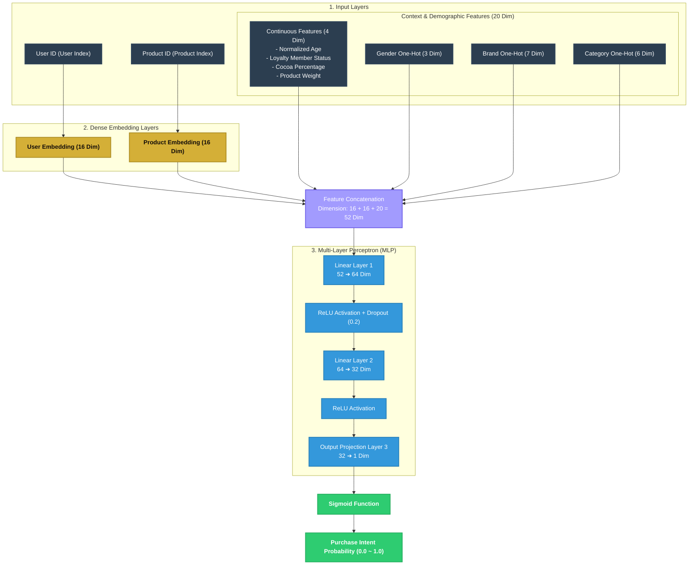

# 🍫 Neural Collaborative Filtering (NCF) Recommender

This directory houses the PyTorch implementation of the **Neural Collaborative Filtering (NCF)** recommendation pipeline combined with **Auxiliary Demographic and Contextual Features**.

---

## 📐 Neural Network Architecture Diagram

The model combines high-dimensional sparse representations (ID Embeddings) with context-aware features, routing them through a multi-layer perceptron (MLP) to output a purchase probability.

---

## 🧠 Architectural Breakdown

### 1. Dense Embedding Layers
* **User Embedding (`self.user_embed`)**: Maps isolated sparse user IDs into a dense **16-dimensional** vector space. Over time, the model naturally clusters users with similar purchasing preferences closer together in this mathematical space.
* **Product Embedding (`self.item_embed`)**: Compresses chocolate item IDs into a **16-dimensional** space, capturing item similarity based on transactional co-occurrence patterns.

### 2. Contextual & Demographic Feature Engineering
To natively handle cold start scenarios and account for store-level dynamics, the model incorporates **20 dimensions of auxiliary features**:
* **Continuous Normalization**: Attributes such as Age, Cocoa Percentage, and Weight are min-max scaled or normalized to the range `[0, 1]` to ensure standard numerical variance across features.
* **One-Hot Encoding**: Categorical fields such as Gender (3 dims), Brand (7 dims), and Product Category (6 dims) are encoded as binary vectors, allowing the neural networks to assign dedicated non-linear weight combinations to each profile discrete category.

### 3. Multi-Layer Perceptron (MLP) Pipeline
* **Feature Concatenation**: The user embedding (16 dims), item embedding (16 dims), and auxiliary context vector (20 dims) are joined together to form a **52-dimensional** global feature representation.
* **Non-linear Intersecting Layers**: Routed through fully connected linear projections (`52 ➔ 64 ➔ 32`), capturing high-order non-linear interaction terms between user demographics, store channels, and chocolate properties.
* **Overfitting Mitigation (Dropout)**: A `Dropout` rate of `0.2` is active on the 64-dimensional layer during training, randomly muting neurons to enforce generalized feature extraction and prevent overfitting.
* **Sigmoid Probability Mapping**: The final projection squeezes the output into a single scalar value. A `Sigmoid` activation function squashes the log-odds score into a real-valued probability space `[0.0, 1.0]`, representing the predicted customer purchase intention shown in the simulator UI.

---

## 🇨🇳 神经网络工作原理解析 (Chinese Guide)

这套神经网络由四个核心阶段组成，巧妙地将**历史行为协同过滤**与**即时画像特征**融合在一起：

### 1. 稠密映射阶段 (Embedding)
* **顾客 Embedding (`self.user_embed`)**：将数以千计的孤立 `User ID` 压缩映射到一个 **16维** 的连续实数向量中。在这个隐藏向量空间里，购买习惯相似的顾客会被拉近。
* **商品 Embedding (`self.item_embed`)**：同理，将巧克力 `Product ID` 压缩映射到 **16维** 向量空间，风味相似的巧克力向量距离会更近。

### 2. 画像与情境特征整合 (Feature Engineering)
除了 ID 之外，模型还集成了 **20维的辅助特征 (Auxiliary Features)**，解决冷启动并捕捉场景信息：
* **数值缩放**：把年龄、可可比例、重量通过归一化（如 `(x - min) / (max - min)`）缩放到 `[0, 1]` 之间，避免数值过大淹没其他特征。
* **独热编码 (One-Hot)**：把类别特征（性别、巧克力品牌、品类）转成 0-1 稀疏向量（如性别转化为 `[男, 女, 未知]`），让神经网络能够独立学习不同分类的权重。

### 3. 特征超级拼接 (Concatenation)
* 模型将 `16维用户向量` + `16维商品向量` + `20维特征向量` 连成一根 **52维** 的超长向量。这根向量同时包含了 **“你是谁”、“你买什么”** 以及 **“你当前有什么属性”**。

### 4. 高维交叉精排 (MLP & Sigmoid)
* **深度全连接网络**：52维特征输入后，通过两层神经网络（`52 ➔ 64 ➔ 32`）进行高阶特征非线性交叉。
* **Dropout (0.2)**：在训练时随机将 20% 的神经元失活，强迫网络不依赖单一特征，有效防止过拟合。
* **Sigmoid 终极预测**：最顶层将 32维特征压缩为 1个实数，通过 Sigmoid 函数映射到 `[0.0, 1.0]` 之间，输出的就是您在 UI 上看到的**「顾客购买意向概率」**。

