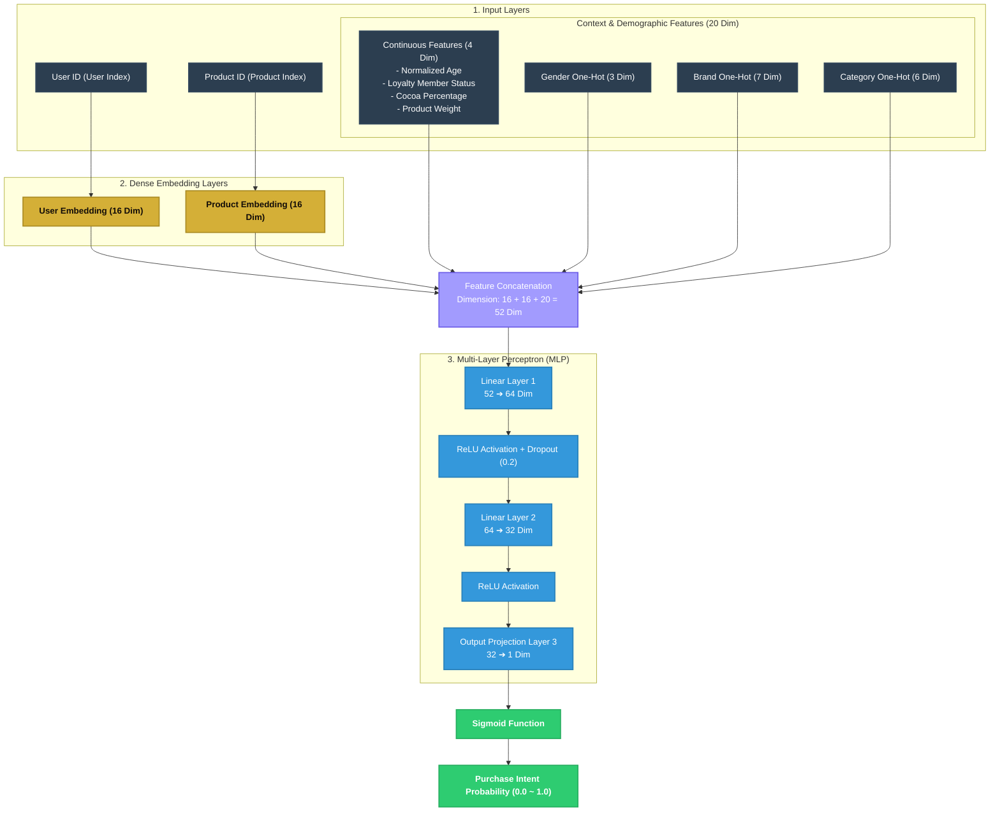

# 🍫 Neural Collaborative Filtering (NCF) Recommender

This directory houses the PyTorch implementation of the **Neural Collaborative Filtering (NCF)** recommendation pipeline combined with **Auxiliary Demographic and Contextual Features**.

---

## 📐 Neural Network Architecture Diagram

The model combines high-dimensional sparse representations (ID Embeddings) with context-aware features, routing them through a multi-layer perceptron (MLP) to output a purchase probability.

---

## 📖 The Shopper's Journey: A Storyline Explanation

To truly understand how this neural network thinks, let’s follow the story of **Alice**, a 28-year-old chocolate enthusiast shopping at the *Airport Premium Store*, as she encounters a candidate product: **Godiva Dark Chocolate 70% (100g)**.

### 🚉 Step 1: The Entry Tickets (Inputs)
When Alice walks into the store (or clicks the app), the system issues three distinct tickets containing raw data:
* **The User Ticket**: Alice's User ID (`C000004`), which maps to index `42` in our vocabulary.
* **The Item Ticket**: The Godiva Dark Chocolate ID (`P0008`), mapping to index `107`.
* **The Context Passport (20 Dimensions)**:
  * Her age group (28 normalized to `0.19`).
  * Her loyalty status (`0` - Regular customer).
  * The chocolate’s attributes (70% cocoa normalized to `0.70`, 100g weight normalized to `0.33`).
  * Her demographic/contextual categories converted to binary signals: Gender is Female (`[0, 1, 0]`), Brand is Godiva (`[0, 0, 0, 0, 1, 0, 0]`), Category is Dark (`[0, 0, 1, 0, 0, 0]`).

---

### 🛂 Step 2: The Passport Office (Embedding Layers)
Raw IDs are meaningless to a neural network's mathematical functions. Alice's index `42` and the Godiva chocolate's index `107` are routed through the **Dense Embedding Layers**:
* **Alice's Persona**: Her ID `42` is mapped to a **16-dimensional vector** of continuous numbers: e.g., `[-0.14, 0.89, ..., 0.31]`. This dense vector acts as a multi-dimensional representation of her latent taste profile (e.g., preference for high-quality dark chocolate, organic origins).
* **Godiva's Character**: The chocolate ID `107` is mapped to its own **16-dimensional vector**: e.g., `[0.45, -0.22, ..., 0.77]`, representing its premium rating, dark richness, and shelf-life character.

---

### 🤝 Step 3: The Assembly Line (Concatenation)
The network now gathers all the pieces of our puzzle. It lays them side-by-side on a single conveyor belt:
$$\text{Concat Vector} = [\underbrace{\text{Alice's 16D Vector}}_{\text{Collaborative Persona}} \,,\, \underbrace{\text{Godiva's 16D Vector}}_{\text{Collaborative Item}} \,,\, \underbrace{\text{Alice's 20D Context Passport}}_{\text{Demographics \& Store Context}}]$$
This results in a unified, super-powered **52-dimensional passport** that perfectly encapsulates *who* Alice is, *what* product she is looking at, and *where* she is shopping.

---

### 🧠 Step 4: The VIP Tasting Lounge (MLP Layers)
The 52-dimensional vector is pushed into the **Multi-Layer Perceptron (MLP)**. This is where the heavy mathematical reasoning happens:
1. **Layer 1 (52 ➔ 64 Dimensions + ReLU)**: The network mixes and matches all signals. It cross-references her age with the chocolate's dark cocoa percentage, and her gender with the luxury Godiva brand. The `ReLU` activation filters out negative activations, keeping only positive, meaningful connections.
2. **Dropout (0.2)**: To ensure the model doesn't overfit (i.e., memorize that *only* young female airport shoppers buy Godiva), a random 20% of the reasoning paths are blacked out. This forces the network to find robust, alternative routes of logic.
3. **Layer 2 (64 ➔ 32 Dimensions + ReLU)**: The network further refines these high-level interactions, condensing them into 32 deep-level semantic features representing various nuances of purchase behavior.
4. **Layer 3 (32 ➔ 1 Dimension)**: Squeezes all the remaining abstract features into a single raw score representing the strength of her desire.

---

### 🏁 Step 5: The Checkout Gate (Sigmoid Activation)
The raw score from the VIP Lounge is currently an unbound number (e.g., `1.68`). To make it actionable for business logic, it passes through the **Sigmoid Checkout Gate**:
* The Sigmoid mathematical function squashes `1.68` into a beautifully calibrated percentage: **`0.843`** (or **84.3%**).

**The Outcome**: The simulator UI dynamically updates! Alice sees **Godiva Dark Chocolate 70%** rise to the top of her recommendations with a glowing green tag: **"Purchase Intent: 84.3%"**.

---

## 🧠 Detailed Neural Network Workflow

The NCF model processes recommendations through four precise operational stages, combining historical collaborative feedback with real-time customer demographics:

### 1. Dense Embedding Stage
* **User Embedding (`self.user_embed`)**: Maps sparse, high-dimensional customer IDs to a dense **16-dimensional** space. Similar customer taste profiles naturally cluster closer together in this latent mathematical space.
* **Item Embedding (`self.item_embed`)**: Maps chocolate product IDs to a dense **16-dimensional** vector space, projecting items with similar co-occurrence and category profiles into adjacent coordinates.

### 2. Demographic & Context Feature Engineering
Beyond sparse IDs, the network integrates **20 dimensions of auxiliary features** to solve cold start limitations and capture immediate context:
* **Continuous Feature Normalization**: Scales features like Age, Cocoa content, and Weight using min-max mapping to a standardized `[0, 1]` range, preventing high-variance attributes from dominating the gradients.
* **One-Hot Encoding**: Encodes categorical attributes (Gender, Brand, and Category) as binary vectors (e.g., Gender ➔ `[Male, Female, Unknown]`), enabling the feed-forward layers to calculate distinct weights per demographic category.

### 3. Feature Concatenation (Combine Stage)
* The model concatenates the `16D User Vector`, the `16D Item Vector`, and the `20D Auxiliary Feature Vector` along the first dimension to build a unified **52-dimensional super-vector**. This represents the complete combination of "shopper identity", "candidate product", and "shopping channel context".

### 4. High-Dimensional Cross-Ranking (MLP & Sigmoid)
* **Feed-Forward Deep Network**: Routes the 52-dimensional representation through standard linear layers (`52 ➔ 64 ➔ 32`) to compute complex non-linear combinations of user demographic profiles and item properties.
* **Dropout (0.2)**: Randomly disables 20% of active nodes during training, forcing the network to discover generalizable pathways instead of memorizing specific user-item pairs.
* **Sigmoid Calibration**: Projects the final 32D semantic representation to a single scalar, applying the `Sigmoid` activation function to output a calibrated probability between `[0.0, 1.0]` (the purchase intent score displayed on the web interface).

---

## 📌 Technical Implementation Highlights

* **NCF Framework (Collaborative & Content Fusion)**: Bypasses classical Matrix Factorization limits, which are blind to demographic inputs, allowing robust context-aware personalized recommendations even for new, anonymous users.
* **Pandas-Free Fast Mapping**: Replaces high-latency Pandas DataFrame `merge` operations with high-efficiency native Python dict maps, bringing massive candidate batch inference speeds down to sub-millisecond ranges.
* **Robust MPS/GPU Fallback**: Includes adaptive device selection. While CUDA accelerates training on Linux/Windows hosts, macOS hosts gracefully default to CPU in multi-process settings, completely avoiding Apple Silicon MPS deadlock bugs in simulation backend servers.

